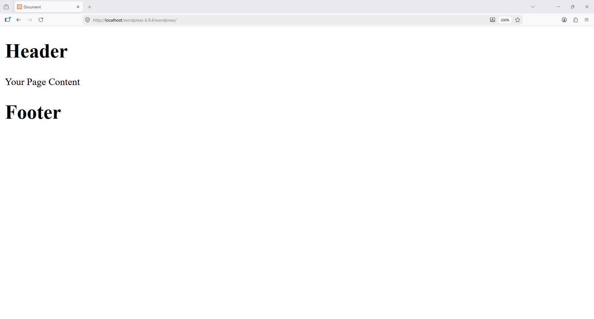

```
https://stackoverflow.com/questions/51584646/how-is-get-header-calling-a-specific-php-file
```

In modern WordPress theme development, if your header and footer files are inside the `parts` folder, you should load them like this:

```php
<?php get_template_part('parts/header'); ?>

<!-- Your Page Content -->

<?php get_template_part('parts/footer'); ?>
```

### Folder Structure Example

```plaintext
your-theme/
│
├── style.css
├── index.php
├── functions.php
├── 404.php
├── single.php
├── page.php
│
└── parts/
    ├── header.php
    └── footer.php
```

### Difference Between Methods

#### Default WordPress Method

```php
<?php get_header(); ?>
<?php get_footer(); ?>
```

This loads:

```plaintext
header.php
footer.php
```

from the theme root folder.

`header.php`
```php
<!DOCTYPE html>
<html lang="en">
<head>
    <meta charset="UTF-8">
    <meta name="viewport" content="width=device-width, initial-scale=1.0">
    <title>Document</title>
</head>
<body>
    
<h1>Header</h1>
```

`footer.php`
```php
    <h1>Footer</h1>
</body>
</html>
```

---

#### Custom Folder Method

```php
<?php get_template_part('parts/header'); ?>
<?php get_template_part('parts/footer'); ?>
```

This loads:

```plaintext
parts/header.php
parts/footer.php
```

from inside the `parts` directory.

---

### Recommended Real Project Structure

```plaintext
your-theme/
│
├── assets/
├── inc/
├── template-parts/
├── parts/
│   ├── header.php
│   ├── footer.php
│   ├── sidebar.php
│   └── sections/
│
├── pages/
├── woocommerce/
└── functions.php
```

### Example 404.php

```php
<?php get_template_part('parts/header'); ?>

<section class="error-404">
    <h1>404</h1>
    <p>Page Not Found</p>
</section>

<?php get_template_part('parts/footer'); ?>
```

