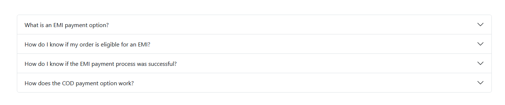

```php
<?php
/**
 * Template Name: Payment Page
 */

get_header();
?>

<main id="primary" class="site-main py-5">

    <div class="container">

        <?php
        while ( have_posts() ) :
            the_post();

            // the_title('<h1 class="mb-4">', '</h1>');

            the_content();

        endwhile;
        ?>

        <div class="accordion mt-5" id="paymentAccordion">

            <!-- Item 1 -->
            <div class="accordion-item">
                <h2 class="accordion-header" id="headingOne">
                    <button class="accordion-button" type="button"
                        data-bs-toggle="collapse"
                        data-bs-target="#collapseOne"
                        aria-expanded="true"
                        aria-controls="collapseOne">

                        What is an EMI payment option?
                    </button>
                </h2>

                <div id="collapseOne"
                    class="accordion-collapse collapse show"
                    aria-labelledby="headingOne"
                    data-bs-parent="#paymentAccordion">

                    <div class="accordion-body text-justify">
                        The EMI or Equated Monthly Instalment payment option allows you to pay for your orders in easy monthly installments, provided you have a card from a partner bank.
                    </div>
                </div>
            </div>

            <!-- Item 2 -->
            <div class="accordion-item">
                <h2 class="accordion-header" id="headingTwo">
                    <button class="accordion-button collapsed" type="button"
                        data-bs-toggle="collapse"
                        data-bs-target="#collapseTwo"
                        aria-expanded="false"
                        aria-controls="collapseTwo">

                        How do I know if my order is eligible for an EMI?
                    </button>
                </h2>

                <div id="collapseTwo"
                    class="accordion-collapse collapse"
                    aria-labelledby="headingTwo"
                    data-bs-parent="#paymentAccordion">

                    <div class="accordion-body text-justify">
                        If your order is eligible for an EMI purchase, you will see the EMI option, along with a table of EMI providers and their corresponding rates and tenures offered, on the product page.
                    </div>
                </div>
            </div>

            <!-- Item 3 -->
            <div class="accordion-item">
                <h2 class="accordion-header" id="headingThree">
                    <button class="accordion-button collapsed" type="button"
                        data-bs-toggle="collapse"
                        data-bs-target="#collapseThree"
                        aria-expanded="false"
                        aria-controls="collapseThree">

                        How do I know if the EMI payment process was successful?
                    </button>
                </h2>

                <div id="collapseThree"
                    class="accordion-collapse collapse"
                    aria-labelledby="headingThree"
                    data-bs-parent="#paymentAccordion">

                    <div class="accordion-body text-justify">
                        As soon as you make your purchase, you will see the full amount charged to your card. It may take a few days for the bank to convert this into an EMI.
                    </div>
                </div>
            </div>

            <!-- Item 4 -->
            <div class="accordion-item">
                <h2 class="accordion-header" id="headingFour">
                    <button class="accordion-button collapsed" type="button"
                        data-bs-toggle="collapse"
                        data-bs-target="#collapseFour"
                        aria-expanded="false"
                        aria-controls="collapseFour">

                        How does the COD payment option work?
                    </button>
                </h2>

                <div id="collapseFour"
                    class="accordion-collapse collapse"
                    aria-labelledby="headingFour"
                    data-bs-parent="#paymentAccordion">

                    <div class="accordion-body text-justify">
                        While making your purchase, select the Cash on Delivery payment option; you can then pay in cash when our logistics partner delivers your order to you.
                    </div>
                </div>
            </div>

        </div>

    </div>

</main>

<?php
get_footer();
?>
```

Add this Bootstrap 5 accordion CSS if needed:

```scss
.accordion-button {
  font-weight: 600;
}

.accordion-button:focus {
  box-shadow: none;
}

.accordion-body {
  line-height: 1.8;
}
```

Make sure Bootstrap 5 JS is loaded in your theme because accordion uses `data-bs-toggle`.

