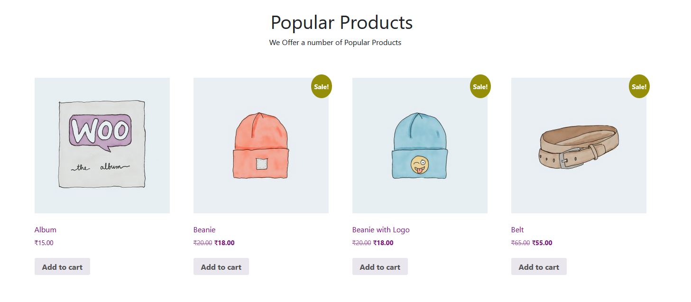

```
https://woocommerce.com/document/woocommerce-shortcodes/#shortcode-attributes
```

`wp-content\themes\custom\front-page.php`

```
<?php
/**
 * The template for displaying all pages
 *
 * This is the template that displays all pages by default.
 * Please note that this is the WordPress construct of pages
 * and that other 'pages' on your WordPress site may use a
 * different template.
 *
 * @link https://developer.wordpress.org/themes/basics/template-hierarchy/
 *
 * @package CUSTOM
 */

get_header();
?>

	<main id="primary" class="site-main">		

		<!-- Popular Products -->
		<section class="container">

			<div class="row d-flex justify-content-center">
				<h1 class="text-center pt-5">Popular Products</h1>
				<p class="w-25">We Offer a number of Popular Products</p>
			</div>

			<div class="pt-5 pb-5">
				<?php echo do_shortcode( '[products columns=4 limit=4]' ); ?>
			</div>

		</section>

	</main><!-- #main -->

<?php
get_footer();

```




`wp-content\themes\your_theme\css\main.scss`
```
.popular-products {
    .add_to_cart_button{
        display: block !important;
        text-align: center;
    }
}
```
