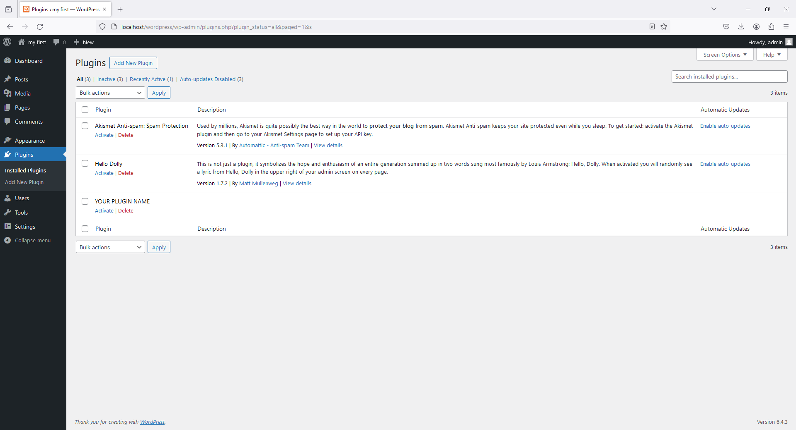
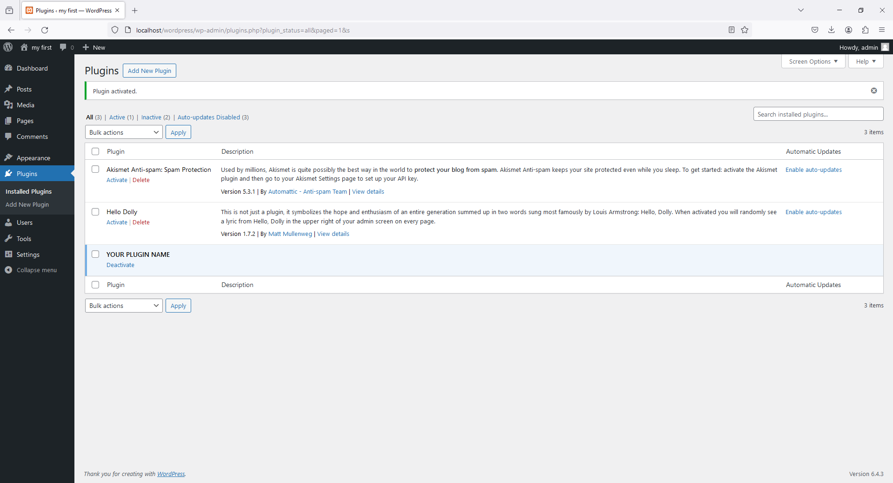
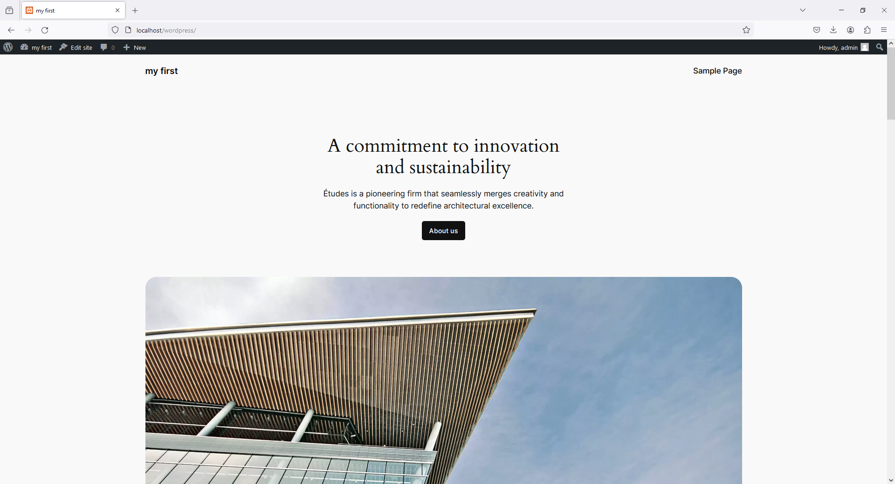
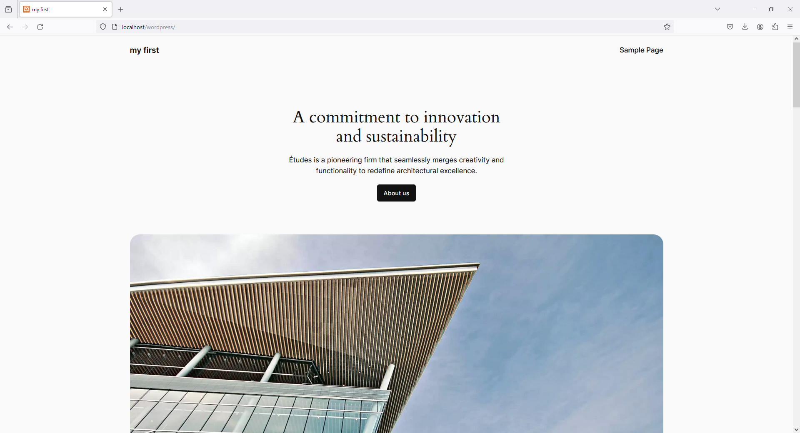

# 1 - Folder Setup

Create Folder

```
htdocs -> project_wordpress -> wp-content -> plugins -> my_first_plugin
```

Create File

```
htdocs -> project_wordpress -> wp-content -> plugins -> my_first_plugin -> my_first_plugin.php
```

# 2 - my_first_plugin.php

```php
<?php

/*
 * Plugin Name: YOUR PLUGIN NAME
 */


 // Remove the admin bar from the front end
add_filter( 'show_admin_bar', '__return_false' );
```









# code-snippets-for-wordpress

```
themeisle.com/blog/code-snippets-for-wordpress
```

# How to Create a Simple WordPress Plugin  2021 WordPress Tutorial

```
https://www.youtube.com/watch?v=7REUdrDM_uE
```