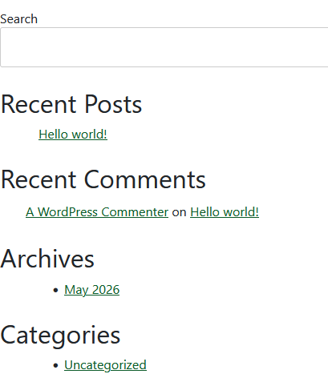

If your **WooCommerce Cart** page is showing:

* Search
* Recent Posts
* Recent Comments
* Archives
* Categories

then your theme is displaying the **default WordPress sidebar** on the Cart page.

### Option 1: Disable the Sidebar (Recommended)

If your theme supports it:

1. Go to **Pages** → **Cart**
2. Edit the page.
3. Look for **Page Layout**, **Sidebar**, or **Template** settings.
4. Change it to:

   * Full Width
   * No Sidebar
   * Elementor Full Width (if using Elementor)

---

### Option 2: Remove Sidebar in `page.php`

If you're using a custom theme (such as Underscores), open `page.php`.

If you have:

```php
<?php get_sidebar(); ?>
```

remove it or wrap it like this:

```php
if ( ! is_cart() && ! is_checkout() ) {
    get_sidebar();
}
```

---

### Option 3: Remove Sidebar via `functions.php`

```php
function remove_woocommerce_sidebar() {
    if ( is_cart() || is_checkout() ) {
        remove_action( 'woocommerce_sidebar', 'woocommerce_get_sidebar', 10 );
    }
}
add_action( 'wp', 'remove_woocommerce_sidebar' );
```

---

### Option 4: Hide Sidebar with CSS (Quick Fix)

```css
.woocommerce-cart #secondary,
.woocommerce-checkout #secondary {
    display: none;
}

.woocommerce-cart #primary,
.woocommerce-checkout #primary {
    width: 100%;
}
```

---

### Option 5: Check Widgets

If the sidebar contains:

* Search
* Recent Posts
* Archives
* Categories

Go to:

**Appearance → Widgets**

or

**Appearance → Customize → Widgets**

Remove these widgets from the **Primary Sidebar**.

---

## If you're using an Underscores (`_s`) theme

Your `page.php` probably looks like this:

```php
<div id="primary" class="content-area">
    <main id="main" class="site-main">
        ...
    </main>
</div>

<?php get_sidebar(); ?>
```

Change it to:

```php
<?php if ( ! is_cart() && ! is_checkout() ) : ?>
    <?php get_sidebar(); ?>
<?php endif; ?>
```

---

### If it still appears

Please share:

1. Your `page.php`
2. Your `woocommerce.php` (if it exists)
3. Your `sidebar.php`

I can tell you the exact line to remove.

